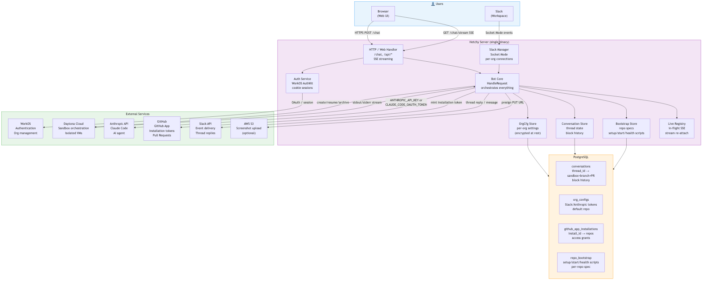
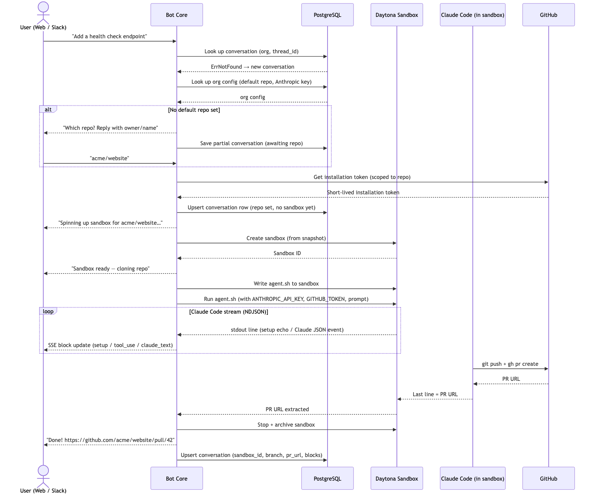
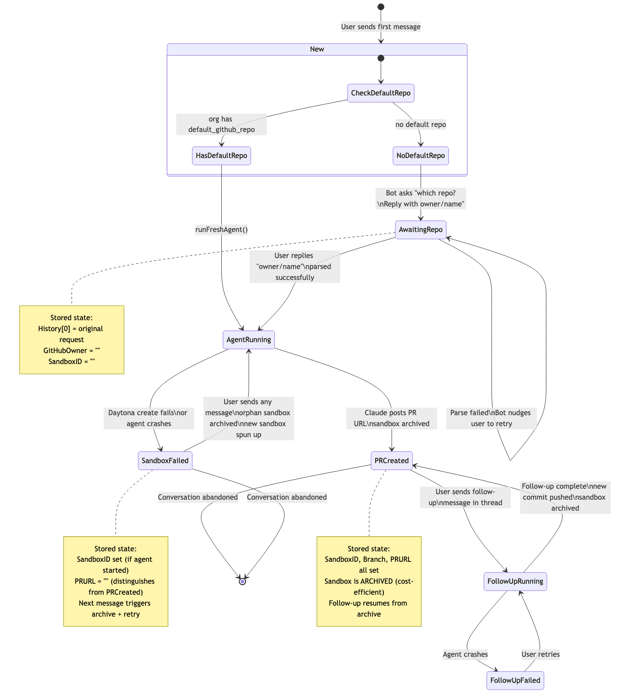
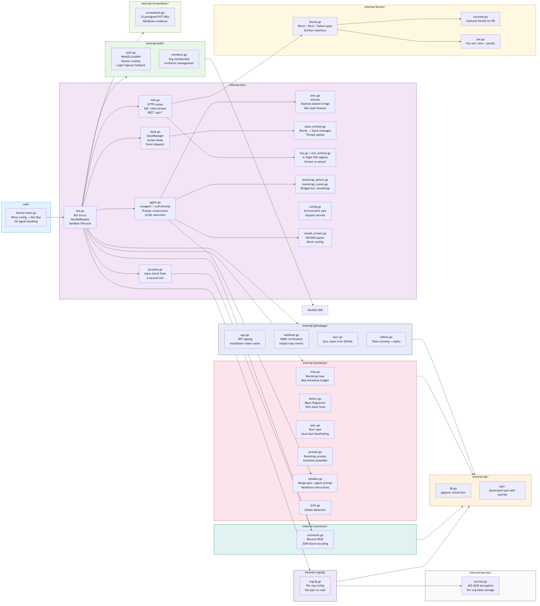
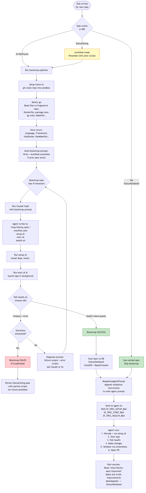
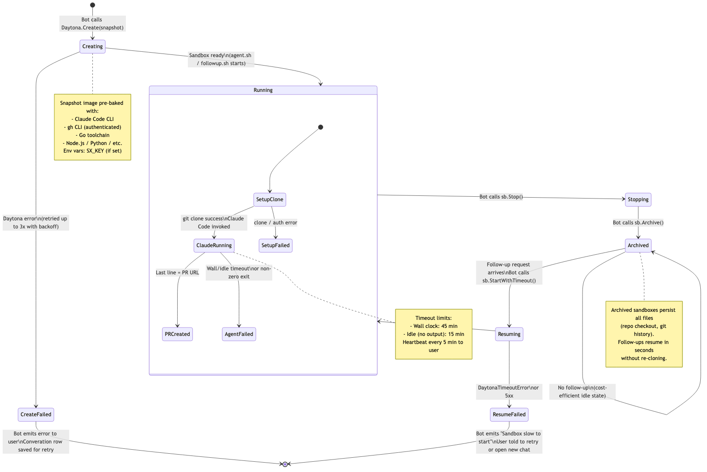
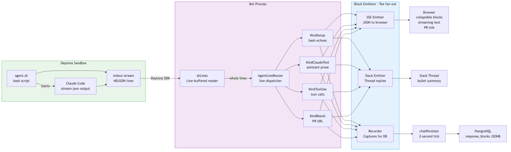

# Hetchy Architecture Diagrams

A visual guide for engineers new to the codebase. Read in order — each diagram builds on the previous.

---

## 1. System Architecture

**What it shows:** Every major component and external service, and how they connect. Hetchy is a single Go binary that serves both the web UI and the Slack bot. All per-org credentials (Anthropic key, Slack tokens, GitHub App) live in PostgreSQL, encrypted at rest — the process only holds the encryption key and infrastructure credentials (Daytona, WorkOS).

---

## 2. Request Data Flow

**What it shows:** The full lifecycle of one user request from message to merged PR, as a sequence diagram. The key insight: the Bot orchestrates everything (sandbox creation, token minting, script execution, streaming) but does not hold long-lived state — all durable state lives in Postgres.

---

## 3. Conversation State Machine

**What it shows:** The explicit states a `conversations` row can be in, and the transitions between them. The dispatcher in `bot.go:HandleRequest` uses the stored `(sandbox_id, pr_url, github_owner)` to decide which code path to take for each incoming message. Key transitions:

| State condition | Meaning | Next action |
|---|---|---|
| `ErrNotFound` | Brand new conversation | Optionally ask for repo, then `runFreshAgent` |
| `owner != "" AND sandbox_id == "" AND pr_url == ""` | Prior attempt failed | Archive orphan, retry |
| `sandbox_id != "" AND pr_url == ""` | Sandbox created, agent failed | Archive orphan, retry |
| `sandbox_id != "" AND pr_url != ""` | PR exists | `handleFollowUp` |

---

## 4. Package Map

**What it shows:** All Go packages and their dependency relationships. `internal/bot` is the central package — it directly imports almost everything else. New feature code almost always starts there. Packages to the right (`auth`, `orgcfg`, `convstore`, etc.) are purpose-built stores/services with narrow interfaces.

---

## 5. Bootstrap Pipeline

**What it shows:** The first-time repo onboarding flow that discovers how to run and validate a repository. On first encounter with a repo, Hetchy runs a multi-step Claude Code loop to produce three scripts (`setup.sh`, `start.sh`, `health.sh`) that can reliably start the app. The result is cached in `repo_bootstrap` and merged into every subsequent agent prompt, enabling end-to-end validation before PRs are opened.

Key concepts:
- **AutoHeal**: If a prior spec is `StatusFailing`, the heal preamble is prepended so Claude knows what failed last time and can bias toward minimal fixes.
- **Spec improvements**: After a successful agent run, the agent can propose improved scripts; these are applied best-effort and the spec is promoted back to `StatusValidated`.

---

## 6. Sandbox Lifecycle

**What it shows:** How Daytona sandboxes move between states across their lifetime. The cost-saving insight: sandboxes are **archived** (not destroyed) after each successful run. An archived sandbox keeps its entire filesystem (repo checkout, build artifacts, git history) and resumes in seconds for follow-up requests — far faster than re-cloning and re-building from scratch.

Timeouts enforced per agent run:
- **Wall clock**: 45 minutes maximum
- **Idle**: 15 minutes without any output (stuck process detection)

---

## 7. Block Streaming Architecture

**What it shows:** How Claude Code's NDJSON output is parsed, structured into typed `Block` values, and fanned out simultaneously to the browser (SSE), Slack (thread replies), and the database (progress persistence). The `Tee` emitter and `Recorder` let a single stream reach all three consumers without coupling them.

Block types:
| Kind | When emitted |
|---|---|
| `setup` | Bash echo lines from `agent.sh` (sandbox setup progress) |
| `notify` | One-shot bot status messages ("Spinning up sandbox…") |
| `claude_text` | Claude's streamed assistant prose |
| `tool_use` | Each tool invocation (Read file, Bash, etc.) |
| `result` | Terminal success — contains the PR URL |
| `error` | Terminal failure — surfaced to user with actionable message |
